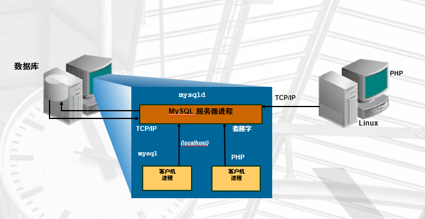
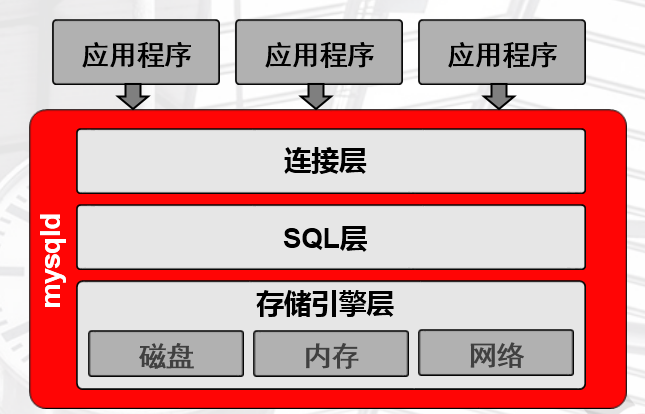
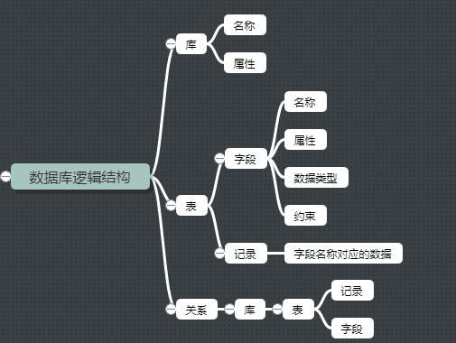
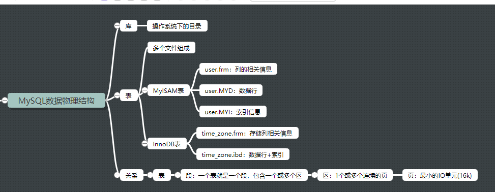
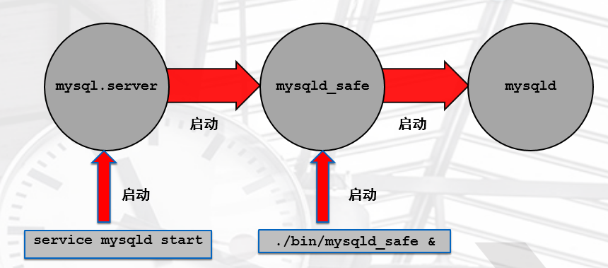

# 1. 体系结构

## 1.1 C/S(客户端/服务端)模型介绍




```undefined
TCP/IP方式（远程、本地）：
mysql -uroot -p123 -h 10.0.0.51 -P3306
Socket方式(仅本地)：
mysql -uroot -p123 -S /tmp/mysql.sock
```

## 1.2 实例介绍


```undefined
实例=mysqld后台守护进程+Master Thread +干活的Thread+预分配的内存
公司=老板+经理+员工+办公室
```

## 1.3 mysqld程序运行原理

### 1.3.1 mysqld程序结构



image

### 1.3.2 一条SQL语句的执行过程


```ruby
1.3.2.1 连接层
（1）提供连接协议：TCP/IP 、SOCKET
（2）提供验证：用户、密码，IP，SOCKET
（3）提供专用连接线程：接收用户SQL，返回结果
通过以下语句可以查看到连接线程基本情况
mysql> show processlist;  
```

1.3.2.2 SQL层 （重点）

```undefined
（1）接收上层传送的SQL语句
（2）语法验证模块：验证语句语法,是否满足SQL_MODE
（3）语义检查：判断SQL语句的类型
DDL ：数据定义语言
DCL ：数据控制语言
DML ：数据操作语言
DQL： 数据查询语言
...
（4）权限检查：用户对库表有没有权限
（5）解析器：对语句执行前,进行预处理，生成解析树(执行计划),说白了就是生成多种执行方案.
（6）优化器：根据解析器得出的多种执行计划，进行判断，选择最优的执行计划
        代价模型：资源（CPU IO MEM）的耗损评估性能好坏
（7）执行器：根据最优执行计划，执行SQL语句，产生执行结果
执行结果：在磁盘的xxxx位置上
（8）提供查询缓存（默认是没开启的），会使用redis tair替代查询缓存功能
（9）提供日志记录（日志管理章节）：binlog，默认是没开启的。
```

1.3.2.3 存储引擎层（类似于Linux中的文件系统）

```undefined
负责根据SQL层执行的结果，从磁盘上拿数据。
将16进制的磁盘数据，交由SQL结构化化成表，
连接层的专用线程返回给用户。
```

## 1.4 逻辑结构



image.png

**以上图片由五行哥提供**

### 1.4.1 库：


```undefined
库名，库属性
```

### 1.4.2 表


```undefined
表名
属性
列:列名(字段),列属性(数据类型,约束等)
数据行(记录)
```

## 1.5 物理存储结构引入



image.png

**以上图片由五行哥提供**

### 1.5.1 库的物理存储结构


```undefined
用文件系统的目录来存储
```

### 1.5.2 表的物理存储结构


```css
MyISAM（一种引擎）的表：
-rw-r----- 1 mysql mysql   10816 Apr 18 11:37 user.frm
-rw-r----- 1 mysql mysql     396 Apr 18 12:20  user.MYD
-rw-r----- 1 mysql mysql    4096 Apr 18 14:48 user.MYI

InnoDB(默认的存储引擎)的表：
-rw-r----- 1 mysql mysql    8636 Apr 18 11:37 time_zone.frm
-rw-r----- 1 mysql mysql   98304 Apr 18 11:37 time_zone.ibd
time_zone.frm：存储列相关信息
time_zone.ibd：数据行+索引
```

### 1.5.3 表的段、区、页（16k）（了解）


```undefined
页：最小的存储单元，默认16k
区：64个连续的页，共1M
段：一个表就是一个段，包含一个或多个区
```

# 2. 基础管理

## 2.1 用户、权限管理

### 2.1.1 用户

作用：


```undefined
登录，管理数据库逻辑对象
```

定义：

```kotlin
用户名@'白名单'
白名单支持的方式？
wordpress@'10.0.0.%'    
wordpress@'%'
wordpress@'10.0.0.200'
wordpress@'localhost'
wordpress@'db02'
wordpress@'10.0.0.5%'
wordpress@'10.0.0.0/255.255.254.0'
```

管理操作：

```css
增：
mysql> create user oldboy@'10.0.0.%' identified by '123';
查：
mysql> desc mysql.user;    ---->  authentication_string
mysql> select user ,host ,authentication_string from mysql.user
改:
mysql> alter user oldboy@'10.0.0.%' identified by '456';
删：
mysql> drop user oldboy@'10.0.0.%';
```

### 2.1.2 权限

权限管理操作：

```css
mysql> grant all on wordpress.* to wordpress@'10.0.0.%' identified  by '123';
```

常用权限介绍:

```dart
ALL:
SELECT,INSERT, UPDATE, DELETE, CREATE, DROP, RELOAD, SHUTDOWN, PROCESS, FILE, REFERENCES, INDEX, ALTER, SHOW DATABASES, SUPER, CREATE TEMPORARY TABLES, LOCK TABLES, EXECUTE, REPLICATION SLAVE, REPLICATION CLIENT, CREATE VIEW, SHOW VIEW, CREATE ROUTINE, ALTER ROUTINE, CREATE USER, EVENT, TRIGGER, CREATE TABLESPACE
ALL : 以上所有权限，一般是普通管理员拥有的
with grant option：超级管理员才具备的，给别的用户授权的功 能
    
```

权限作用范围:

```rust
*.*                  ---->管理员用户
wordpress.*          ---->开发和应用用户
wordpress.t1
```

需求1：windows机器的navicat登录到linux中的MySQL，管理员用户。

```css
mysql> grant all on *.* to root@'10.0.0.%' identified by '123';
```

需求2：创建一个应用用户app用户，能从windows上登录mysql，并能操作app库

```csharp
mysql> grant select ,update,insert,delete on app.* to app@'10.0.0.%' identified by '123';
```

### 2.1.3 开发人员用户授权流程

```undefined
1.权限
2.对谁操作
3.你从哪来
4.密码要求
```

### 2.1.4 提示：8.0在grant命令添加新特性

```undefined
建用户和授权分开了
grant 不再支持自动创建用户了，不支持改密码
授权之前，必须要提前创建用户。
```

### 2.1.5 查看授权

```css
mysql> show grants for app@'10.0.0.%';
```

### 2.1.6 回收权限

```csharp
revoke  delete on app.*  from app@'10.0.0.%'；
```

### 2.1.7 本地管理员用户密码忘记.

```csharp
[root@db01 ~]# mysqld_safe --skip-grant-tables --skip-networking &
mysql> flush privileges;   #把授权表刷到内存
mysql>  alter user root@'localhost' identified by '123456';
[root@db01 ~]# pkill mysqld
[root@db01 ~]# systemctl start  mysqld
```

## 2.2 连接管理

### 2.2.1 自带客户端命令

mysql  常用参数：

```ruby
-u                   用户
-p                   密码
-h                   IP
-P                   端口
-S                   socket文件
-e                   免交互执行命令
<                    导入SQL脚本

[root@db01 ~]# mysql -uroot -p -h 10.0.0.51 -P3306
Enter password:
mysql> select @@socket;
+-----------------+
| @@socket        |
+-----------------+
| /tmp/mysql.sock |
[root@db01 ~]# mysql -uroot -p -S /tmp/mysql.sock
Enter password:
[root@db01 ~]# mysql -uroot -p -e "select user,host from mysql.user;"
Enter password:
+---------------+-----------+
| user          | host      |
+---------------+-----------+
| abc          | 10.0.0.%  |
| app          | 10.0.0.%  |
| root          | 10.0.0.%  |
| mysql.session | localhost |
| mysql.sys    | localhost |
| root          | localhost |
+---------------+-----------+
[root@db01 ~]#
[root@db01 ~]# mysql -uroot -p <world.sql
Enter password:
[root@db01 ~]#
```

## 2.3 多种启动方式介绍



image

提示：


```undefined
以上多种方式，都可以单独启动MySQL服务
mysqld_safe和mysqld一般是在临时维护时使用。
另外，从Centos 7系统开始，支持systemd直接调用mysqld的方式进行启动数据库
```

## 2.4 初始化配置

### 2.4.0 作用


```undefined
控制MySQL的启动
影响到客户端的连接
```

### 2.4.1 初始化配置的方法


```undefined
预编译
**配置文件(所有启动方式)**
命令行参数 (仅限于 mysqld_safe mysqld)
```

### 2.4.2 初始配置文件

初始化配置文件的默认读取路径


```bash
[root@db01 ~]# mysqld --help --verbose |grep my.cnf
/etc/my.cnf /etc/mysql/my.cnf /usr/local/mysql/etc/my.cnf ~/.my.cnf
注:
默认情况下，MySQL启动时，会依次读取以上配置文件，如果有重复选项，会以最后一个文件设置的为准。
但是，如果启动时加入了--defaults-file=xxxx时，以上的所有文件都不会读取.
```

配置文件的书写方式:


```csharp
[标签]
配置项=xxxx

标签类型：服务端、客户端
服务器端标签：
[mysqld]
[mysqld_safe]
[server]

客户端标签：
[mysql]
[mysqldump]
[client]

配置文件的示例展示：
[root@db01 ~]# cat /etc/my.cnf
[mysqld]
user=mysql
basedir=/app/mysql
datadir=/data/mysql
socket=/tmp/mysql.sock
server_id=6
port=3306
log_error=/data/mysql/mysql.log
[mysql]
socket=/tmp/mysql.sock
prompt=Master [\\d]>
```

## 2.5 多实例的应用

### 2.5.1 准备多个目录


```kotlin
mkdir -p /data/330{7,8,9}/data
```

### 2.5.2 准备配置文件


```jsx
cat > /data/3307/my.cnf <<EOF
[mysqld]
basedir=/app/mysql
datadir=/data/3307/data
socket=/data/3307/mysql.sock
log_error=/data/3307/mysql.log
port=3307
server_id=7
log_bin=/data/3307/mysql-bin
EOF

cat > /data/3308/my.cnf <<EOF
[mysqld]
basedir=/app/mysql
datadir=/data/3308/data
socket=/data/3308/mysql.sock
log_error=/data/3308/mysql.log
port=3308
server_id=8
log_bin=/data/3308/mysql-bin
EOF

cat > /data/3309/my.cnf <<EOF
[mysqld]
basedir=/app/mysql
datadir=/data/3309/data
socket=/data/3309/mysql.sock
log_error=/data/3309/mysql.log
port=3309
server_id=9
log_bin=/data/3309/mysql-bin
EOF
```

### 2.5.3 初始化三套数据


```jsx
mv /etc/my.cnf /etc/my.cnf.bak
mysqld --initialize-insecure  --user=mysql --datadir=/data/3307/data --basedir=/app/mysql
mysqld --initialize-insecure  --user=mysql --datadir=/data/3308/data --basedir=/app/mysql
mysqld --initialize-insecure  --user=mysql --datadir=/data/3309/data --basedir=/app/mysql
```

### 2.5.4 systemd管理多实例


```ruby
cd /etc/systemd/system
cp mysqld.service mysqld3307.service
cp mysqld.service mysqld3308.service
cp mysqld.service mysqld3309.service

vim mysqld3307.service
ExecStart=/app/mysql/bin/mysqld  --defaults-file=/data/3307/my.cnf
vim mysqld3308.service
ExecStart=/app/mysql/bin/mysqld  --defaults-file=/data/3308/my.cnf
vim mysqld3309.service
ExecStart=/app/mysql/bin/mysqld  --defaults-file=/data/3309/my.cnf
```

### 2.5.5 授权


```kotlin
chown -R mysql.mysql /data/*
```

### 2.5.6 启动


```css
systemctl start mysqld3307.service
systemctl start mysqld3308.service
systemctl start mysqld3309.service
```

### 2.5.7 验证多实例


```kotlin
netstat -lnp|grep 330
mysql -S /data/3307/mysql.sock -e "select @@server_id"
mysql -S /data/3308/mysql.sock -e "select @@server_id"
mysql -S /data/3309/mysql.sock -e "select @@server_id"
```


​	