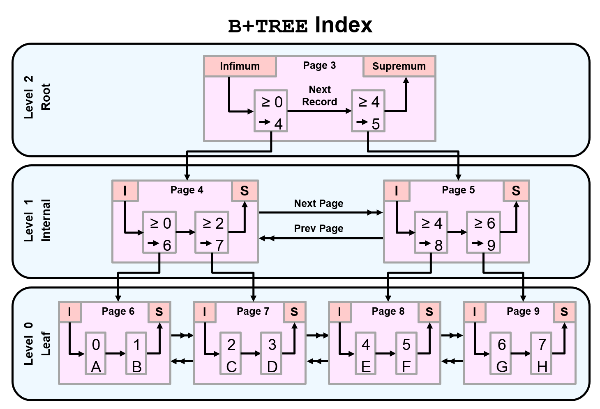
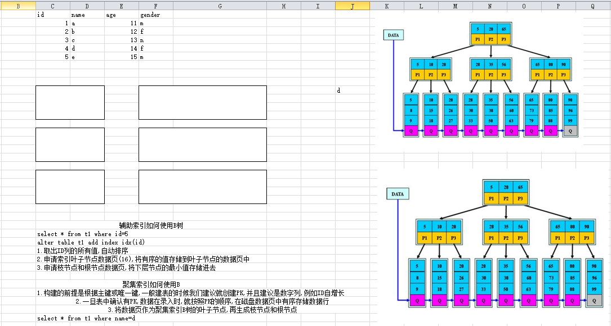
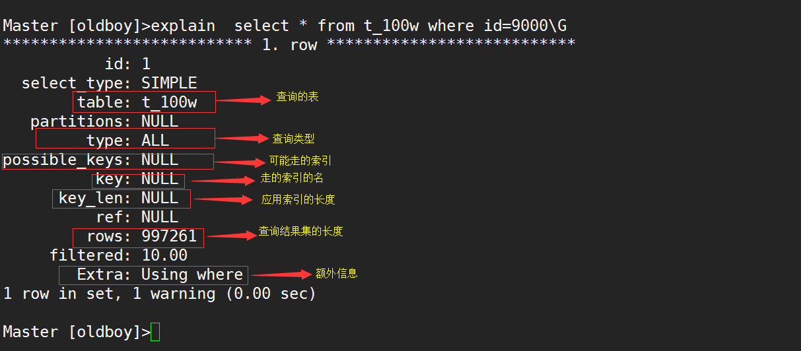

# 1. 索引作用


```undefined
提供了类似于书中目录的作用,目的是为了优化查询
```

# 2. 索引的种类(算法)


```undefined
B树索引
Hash索引
R树
Full text
GIS 
```

# 3. B树 基于不同的查找算法分类介绍



image.png


```jsx
B-tree
B+Tree 在范围查询方面提供了更好的性能(> < >= <= like)
B*Tree
```

# 4. 在功能上的分类

## 4.1 辅助索引(S)怎么构建B树结构的?


```csharp
(1). 索引是基于表中,列(索引键)的值生成的B树结构
(2). 首先提取此列所有的值,进行自动排序
(3). 将排好序的值,均匀的分布到索引树的叶子节点中(16K)
(4). 然后生成此索引键值所对应得后端数据页的指针
(5). 生成枝节点和根节点,根据数据量级和索引键长度,生成合适的索引树高度
id  name  age  gender
select  *  from  t1 where id=10;
问题: 基于索引键做where查询,对于id列是顺序IO,但是对于其他列的查询,可能是随机IO.
```

## 4.2 聚集索引(C)

### 4.2.1 前提


```undefined
(1)表中设置了主键,主键列就会自动被作为聚集索引.
(2)如果没有主键,会选择唯一键作为聚集索引.
(3)聚集索引必须在建表时才有意义,一般是表的无关列(ID)
```

### 4.2.2 辅助索引(S)怎么构建B树结构的?


```undefined
(1) 在建表时,设置了主键列(ID)
(2) 在将来录入数据时,就会按照ID列的顺序存储到磁盘上.(我们又称之为聚集索引组织表)
(3) 将排好序的整行数据,生成叶子节点.可以理解为,磁盘的数据页就是叶子节点
```

### 4.2.3  聚集索引和辅助索引构成区别


```undefined
聚集索引只能有一个,非空唯一,一般时主键
辅助索引,可以有多个,时配合聚集索引使用的
聚集索引叶子节点,就是磁盘的数据行存储的数据页
MySQL是根据聚集索引,组织存储数据,数据存储时就是按照聚集索引的顺序进行存储数据
辅助索引,只会提取索引键值,进行自动排序生成B树结构
```



image.png

# 5.辅助索引细分


```undefined
1.普通的单列辅助索引
2.联合索引
多个列作为索引条件,生成索引树,理论上设计的好的,可以减少大量的回表
查询
3.唯一索引
索引列的值都是唯一的.
```

# 6. 关于索引树的高度受什么影响


```csharp
1. 数据量级, 解决方法:分表,分库,分布式
2. 索引列值过长 , 解决方法:前缀索引
3. 数据类型:
变长长度字符串,使用了char,解决方案:变长字符串使用varchar
enum类型的使用enum ('山东','河北','黑龙江','吉林','辽宁','陕西'......)
                                         1      2      3
```

# 7. 索引的基本管理

## 7.1 索引建立前


```ruby
db01 [world]>desc city;
+-------------+----------+------+-----+---------+----------------+
| Field      | Type    | Null | Key | Default | Extra          |
+-------------+----------+------+-----+---------+----------------+
| ID          | int(11)  | NO  | PRI | NULL    | auto_increment |
| Name        | char(35) | NO  |    |        |                |
| CountryCode | char(3)  | NO  | MUL |        |                |
| District    | char(20) | NO  |    |        |                |
| Population  | int(11)  | NO  |    | 0      |                |
+-------------+----------+------+-----+---------+----------------+
5 rows in set (0.00 sec)

Field :列名字
key  :有没有索引,索引类型
PRI: 主键索引
UNI: 唯一索引
MUL: 辅助索引(单列,联和,前缀)
```

## 7.1 单列普通辅助索引

### 7.1.1 创建索引


```csharp
db01 [world]>alter table city add index idx_name(name);
                                       表                    索引名（列名）
db01 [world]>create index idx_name1 on city(name);
db01 [world]>show index from city;

注意:
以上操作不代表生产操作,我们不建议在一个列上建多个索引
同一个表中，索引名不能同名。
### 7.1.2 删除索引:
db01 [world]>alter table city drop index idx_name1;
                                        表名                 索引名
```

### 7.2 覆盖索引(联合索引)


```csharp
Master [world]>alter table city add index idx_co_po(countrycode,population);
```

### 7.3 前缀索引


```csharp
db01 [world]>alter table city add index idx_di(district(5));
注意：数字列不能用作前缀索引。
```

### 7.4 唯一索引


```csharp
db01 [world]>alter table city add unique index idx_uni1(name);
ERROR 1062 (23000): Duplicate entry 'San Jose' for key 'idx_uni1'
```

统计city表中，以省的名字为分组，统计组的个数


```csharp
select district,count(id) from city group by district;
需求: 找到world下,city表中 name列有重复值的行,最后删掉重复的行
db01 [world]>select name,count(id) as cid from city group by name  having cid>1 order by cid desc;
db01 [world]>select * from city where name='suzhou';
```

===============================================

# 8. 执行计划获取及分析

## 8.0 介绍


```csharp
(1)
获取到的是优化器选择完成的,他认为代价最小的执行计划.
作用: 语句执行前,先看执行计划信息,可以有效的防止性能较差的语句带来的性能问题.
如果业务中出现了慢语句，我们也需要借助此命令进行语句的评估，分析优化方案。
(2) select 获取数据的方法
1. 全表扫描(应当尽量避免,因为性能低)
2. 索引扫描
3. 获取不到数据
```

## 8.1 执行计划获取

获取优化器选择后的执行计划


image




image

## 8.2 执行计划分析

### 8.2.0 重点关注的信息


```bash
table: city                              ---->查询操作的表    **
possible_keys: CountryCode,idx_co_po      ---->可能会走的索引  **
key: CountryCode   ---->真正走的索引    ***
type: ref   ---->索引类型        *****
Extra: Using index condition              ---->额外信息        *****
```

### 8.2.1 type详解


```php
从左到右性能依次变好.
ALL  :  
全表扫描,不走索引
例子:
1. 查询条件列,没有索引
SELECT * FROM t_100w WHERE k2='780P';  
2. 查询条件出现以下语句(辅助索引列)
USE world 
DESC city;
DESC SELECT * FROM city WHERE countrycode <> 'CHN';
DESC SELECT * FROM city WHERE countrycode NOT IN ('CHN','USA');
DESC SELECT * FROM city WHERE countrycode LIKE '%CH%';
注意:对于聚集索引列,使用以上语句,依然会走索引
DESC SELECT * FROM city WHERE id <> 10;

INDEX  :
全索引扫描
1. 查询需要获取整个索引树种的值时:
DESC  SELECT countrycode  FROM city;

2. 联合索引中,任何一个非最左列作为查询条件时:
idx_a_b_c(a,b,c)  ---> a  ab  abc

SELECT * FROM t1 WHERE b 
SELECT * FROM t1 WHERE c    

RANGE :
索引范围扫描 
辅助索引> < >= <= LIKE IN OR 
主键 <>  NOT IN

例子:
1. 
DESC SELECT * FROM city WHERE id<5;
2. 
DESC SELECT * FROM city WHERE countrycode LIKE 'CH%';
3. 
DESC SELECT * FROM city WHERE countrycode IN ('CHN','USA');

注意: 
1和2例子中,可以享受到B+树的优势,但是3例子中是不能享受的.
所以,我们可以将3号列子改写:

DESC SELECT * FROM city WHERE countrycode='CHN'
UNION ALL 
SELECT * FROM city WHERE countrycode='USA';
ref: 
非唯一性索引,等值查询
DESC SELECT * FROM city WHERE countrycode='CHN';
eq_ref: 
在多表连接时,连接条件使用了唯一索引(uk  pK)

DESC SELECT b.name,a.name FROM city AS a 
JOIN country AS b 
ON a.countrycode=b.code 
WHERE a.population <100;
DESC country
system,const :
唯一索引的等值查询
DESC SELECT * FROM city WHERE id=10;
```

### 8.2.2 其他字段解释


```kotlin
extra: 
filesort ,文件排序.
SHOW INDEX FROM city;
ALTER TABLE city ADD INDEX CountryCode(CountryCode);
ALTER TABLE city DROP INDEX idx_c_p;

DESC SELECT * FROM city WHERE countrycode='CHN'  ORDER BY population 

ALTER TABLE city ADD INDEX idx_(population);
DESC SELECT * FROM city WHERE countrycode='CHN'  ORDER BY population 
ALTER TABLE city ADD INDEX idx_c_p(countrycode,population);
ALTER TABLE city DROP INDEX idx_;
ALTER TABLE city DROP INDEX CountryCode;
DESC SELECT * FROM city WHERE countrycode='CHN'  ORDER BY population 

结论: 
1.当我们看到执行计划extra位置出现filesort,说明由文件排序出现
2.观察需要排序(ORDER BY,GROUP BY ,DISTINCT )的条件,有没有索引
3. 根据子句的执行顺序,去创建联合索引

索引优化效果测试:
优化前:
[root@db01 ~]# mysqlslap --defaults-file=/etc/my.cnf \
> --concurrency=100 --iterations=1 --create-schema='oldboy' \
> --query="select * from oldboy.t_100w where k2='780P'" engine=innodb \
> --number-of-queries=2000 -uroot -p123 -verbose
mysqlslap: [Warning] Using a password on the command line interface can be insecure.
Benchmark
    Running for engine rbose
    Average number of seconds to run all queries: 701.743 seconds
    Minimum number of seconds to run all queries: 701.743 seconds
    Maximum number of seconds to run all queries: 701.743 seconds
    Number of clients running queries: 100
    Average number of queries per client: 20

优化后:
[root@db01 ~]# mysqlslap --defaults-file=/etc/my.cnf --concurrency=100 --iterations=1 --create-schema='oldboy' --query="select * from oldboy.t_100w where k2='780P'" engine=innodb --number-of-queries=2000 -uroot -p123 -verbose
mysqlslap: [Warning] Using a password on the command line interface can be insecure.
Benchmark
    Running for engine rbose
    Average number of seconds to run all queries: 0.190 seconds
    Minimum number of seconds to run all queries: 0.190 seconds
    Maximum number of seconds to run all queries: 0.190 seconds
    Number of clients running queries: 100
    Average number of queries per client: 20

联合索引:
1. SELECT * FROM t1  WHERE a=    b=   
我们建立联合索引时:
ALTER TABLE t1 ADD INDEX idx_a_b(a,b);  
ALTER TABLE t1 ADD INDEX idx_b_a(b,a);  
以上的查询不考虑索引的顺序,优化器会自动调整where的条件顺序
注意: 索引,我们在这种情况下建索引时,需要考虑哪个列的唯一值更多,哪个放在索引左边.

2.  如果出现where 条件中出现不等值查询条件
DESC  SELECT * FROM t_100w WHERE num <1000 AND k2='DEEF';
我们建索引时:
ALTER TABLE t_100w ADD INDEX idx_2_n(k2,num);
语句书写时
DESC  SELECT * FROM t_100w WHERE  k2='DEEF'  AND  num <1000 ;
3. 如果查询中出现多子句
我们要按照子句的执行顺序进行建立索引.
```

### 8.2.3 explain(desc)使用场景（面试题）


```css
题目意思:  我们公司业务慢,请你从数据库的角度分析原因
1.mysql出现性能问题,我总结有两种情况:
（1）应急性的慢：突然夯住
应急情况:数据库hang(卡了,资源耗尽)
处理过程:
1.show processlist;  获取到导致数据库hang的语句
2. explain 分析SQL的执行计划,有没有走索引,索引的类型情况
3. 建索引,改语句
（2）一段时间慢(持续性的):
(1)记录慢日志slowlog,分析slowlog
(2)explain 分析SQL的执行计划,有没有走索引,索引的类型情况
(3)建索引,改语句
```

# 9.  索引应用规范


```rust
业务
1.产品的功能
2.用户的行为
"热"查询语句 --->较慢--->slowlog
"热"数据
```

## 9.1  建立索引的原则（DBA运维规范）

### 9.1.0 说明


```undefined
为了使索引的使用效率更高，在创建索引时，必须考虑在哪些字段上创建索引和创建什么类型的索引。那么索引设计原则又是怎样的?
```

### 9.1.1 (必须的) 建表时一定要有主键,一般是个无关列

略.回顾一下,聚集索引结构.

### 9.1.2 选择唯一性索引


```csharp
唯一性索引的值是唯一的，可以更快速的通过该索引来确定某条记录。
例如，学生表中学号是具有唯一性的字段。为该字段建立唯一性索引可以很快的确定某个学生的信息。
如果使用姓名的话，可能存在同名现象，从而降低查询速度。

优化方案:
(1) 如果非得使用重复值较多的列作为查询条件(例如:男女),可以将表逻辑拆分
(2) 可以将此列和其他的查询类,做联和索引
select count(*) from world.city;
select count(distinct countrycode) from world.city;
select count(distinct countrycode,population ) from world.city;
```

### 9.1.3(必须的) 为经常需要where 、ORDER BY、GROUP BY,join on等操作的字段，


```csharp
排序操作会浪费很多时间。
where  A B C      ----》 A  B  C
in 
where A   group by B  order by C
A,B，C

如果为其建立索引，优化查询
注：如果经常作为条件的列，重复值特别多，可以建立联合索引。
```

### 9.1.4 尽量使用前缀来索引


```undefined
如果索引字段的值很长，最好使用值的前缀来索引。
```

### 9.1.5 限制索引的数目


```undefined
索引的数目不是越多越好。
可能会产生的问题:
(1) 每个索引都需要占用磁盘空间，索引越多，需要的磁盘空间就越大。
(2) 修改表时，对索引的重构和更新很麻烦。越多的索引，会使更新表变得很浪费时间。
(3) 优化器的负担会很重,有可能会影响到优化器的选择.
percona-toolkit中有个工具,专门分析索引是否有用
```

### 9.1.6 删除不再使用或者很少使用的索引(percona toolkit)


```undefined
pt-duplicate-key-checker

表中的数据被大量更新，或者数据的使用方式被改变后，原有的一些索引可能不再需要。数据库管理
员应当定期找出这些索引，将它们删除，从而减少索引对更新操作的影响。
```

### 9.1.7 大表加索引,要在业务不繁忙期间操作

### 9.1.8 尽量少在经常更新值的列上建索引

### 9.1.9 建索引原则


```csharp
(1) 必须要有主键,如果没有可以做为主键条件的列,创建无关列
(2) 经常做为where条件列  order by  group by  join on, distinct 的条件(业务:产品功能+用户行为)
(3) 最好使用唯一值多的列作为索引,如果索引列重复值较多,可以考虑使用联合索引
(4) 列值长度较长的索引列,我们建议使用前缀索引.
(5) 降低索引条目,一方面不要创建没用索引,不常使用的索引清理,percona toolkit(xxxxx)
(6) 索引维护要避开业务繁忙期
```

## 9.2 不走索引的情况（开发规范）

### 9.2.1 没有查询条件，或者查询条件没有建立索引


```csharp
select * from tab;       全表扫描。
select  * from tab where 1=1;
在业务数据库中，特别是数据量比较大的表。
是没有全表扫描这种需求。
1、对用户查看是非常痛苦的。
2、对服务器来讲毁灭性的。
（1）
select * from tab;
SQL改写成以下语句：
select  * from  tab  order by  price  limit 10 ;    需要在price列上建立索引
（2）
select  * from  tab where name='zhangsan'          name列没有索引
改：
1、换成有索引的列作为查询条件
2、将name列建立索引
```

### 9.2.2 查询结果集是原表中的大部分数据，应该是25％以上。


```objectivec
查询的结果集，超过了总数行数25%，优化器觉得就没有必要走索引了。

假如：tab表 id，name    id:1-100w  ，id列有(辅助)索引
select * from tab  where id>500000;
如果业务允许，可以使用limit控制。
怎么改写 ？
结合业务判断，有没有更好的方式。如果没有更好的改写方案
尽量不要在mysql存放这个数据了。放到redis里面。
```

### 9.2.3  索引本身失效，统计数据不真实


```csharp
索引有自我维护的能力。
对于表内容变化比较频繁的情况下，有可能会出现索引失效。
一般是删除重建

现象:
有一条select语句平常查询时很快,突然有一天很慢,会是什么原因
select?  --->索引失效,，统计数据不真实
DML ?   --->锁冲突
```

### 9.2.4 查询条件使用函数在索引列上，或者对索引列进行运算，运算包括(+，-，*，/，! 等)


```csharp
例子：
错误的例子：select * from test where id-1=9;
正确的例子：select * from test where id=10;
算术运算
函数运算
子查询
```

### 9.2.5  隐式转换导致索引失效.这一点应当引起重视.也是开发中经常会犯的错误.


```ruby
这样会导致索引失效. 错误的例子：
mysql> alter table tab add index inx_tel(telnum);
Query OK, 0 rows affected (0.03 sec)
Records: 0  Duplicates: 0  Warnings: 0
mysql>
mysql> desc tab;
+--------+-------------+------+-----+---------+-------+
| Field  | Type        | Null | Key | Default | Extra |
+--------+-------------+------+-----+---------+-------+
| id    | int(11)    | YES  |    | NULL    |      |
| name  | varchar(20) | YES  |    | NULL    |      |
| telnum | varchar(20) | YES  | MUL | NULL    |      |
+--------+-------------+------+-----+---------+-------+
3 rows in set (0.01 sec)
mysql> select * from tab where telnum='1333333';
+------+------+---------+
| id  | name | telnum  |
+------+------+---------+
|    1 | a    | 1333333 |
+------+------+---------+
1 row in set (0.00 sec)
mysql> select * from tab where telnum=1333333;
+------+------+---------+
| id  | name | telnum  |
+------+------+---------+
|    1 | a    | 1333333 |
+------+------+---------+
1 row in set (0.00 sec)
mysql> explain  select * from tab where telnum='1333333';
+----+-------------+-------+------+---------------+---------+---------+-------+------+-----------------------+
| id | select_type | table | type | possible_keys | key    | key_len | ref  | rows | Extra                |
+----+-------------+-------+------+---------------+---------+---------+-------+------+-----------------------+

|  1 | SIMPLE      | tab  | ref  | inx_tel      | inx_tel | 63      | const |    1 | Using index condition |
+----+-------------+-------+------+---------------+---------+---------+-------+------+-----------------------+
1 row in set (0.00 sec)
mysql> explain  select * from tab where telnum=1333333;
+----+-------------+-------+------+---------------+------+---------+------+------+-------------+
| id | select_type | table | type | possible_keys | key  | key_len | ref  | rows | Extra      |
+----+-------------+-------+------+---------------+------+---------+------+------+-------------+
|  1 | SIMPLE      | tab  | ALL  | inx_tel      | NULL | NULL    | NULL |    2 | Using where |
+----+-------------+-------+------+---------------+------+---------+------+------+-------------+
1 row in set (0.00 sec)
mysql> explain  select * from tab where telnum=1555555;
+----+-------------+-------+------+---------------+------+---------+------+------+-------------+
| id | select_type | table | type | possible_keys | key  | key_len | ref  | rows | Extra      |
+----+-------------+-------+------+---------------+------+---------+------+------+-------------+
|  1 | SIMPLE      | tab  | ALL  | inx_tel      | NULL | NULL    | NULL |    2 | Using where |
+----+-------------+-------+------+---------------+------+---------+------+------+-------------+
1 row in set (0.00 sec)
mysql> explain  select * from tab where telnum='1555555';
+----+-------------+-------+------+---------------+---------+---------+-------+------+-----------------------+
| id | select_type | table | type | possible_keys | key    | key_len | ref  | rows | Extra                |
+----+-------------+-------+------+---------------+---------+---------+-------+------+-----------------------+
|  1 | SIMPLE      | tab  | ref  | inx_tel      | inx_tel | 63      | const |    1 | Using index condition |
+----+-------------+-------+------+---------------+---------+---------+-------+------+-----------------------+
1 row in set (0.00 sec)
mysql>
```

### 9.2.6  <>  ，not in 不走索引（辅助索引）


```csharp
EXPLAIN  SELECT * FROM teltab WHERE telnum  <> '110';
EXPLAIN  SELECT * FROM teltab WHERE telnum  NOT IN ('110','119');

mysql> select * from tab where telnum <> '1555555';
+------+------+---------+
| id  | name | telnum  |
+------+------+---------+
|    1 | a    | 1333333 |
+------+------+---------+
1 row in set (0.00 sec)
mysql> explain select * from tab where telnum <> '1555555';

单独的>,<,in 有可能走，也有可能不走，和结果集有关，尽量结合业务添加limit
or或in  尽量改成union
EXPLAIN  SELECT * FROM teltab WHERE telnum  IN ('110','119');
改写成：
EXPLAIN SELECT * FROM teltab WHERE telnum='110'
UNION ALL
SELECT * FROM teltab WHERE telnum='119'
```

### 9.2.7  like "%_" 百分号在最前面不走


```go
EXPLAIN SELECT * FROM teltab WHERE telnum LIKE '31%'  走range索引扫描
EXPLAIN SELECT * FROM teltab WHERE telnum LIKE '%110'  不走索引
%linux%类的搜索需求，可以使用elasticsearch+mongodb 专门做搜索服务的数据库产品
```


